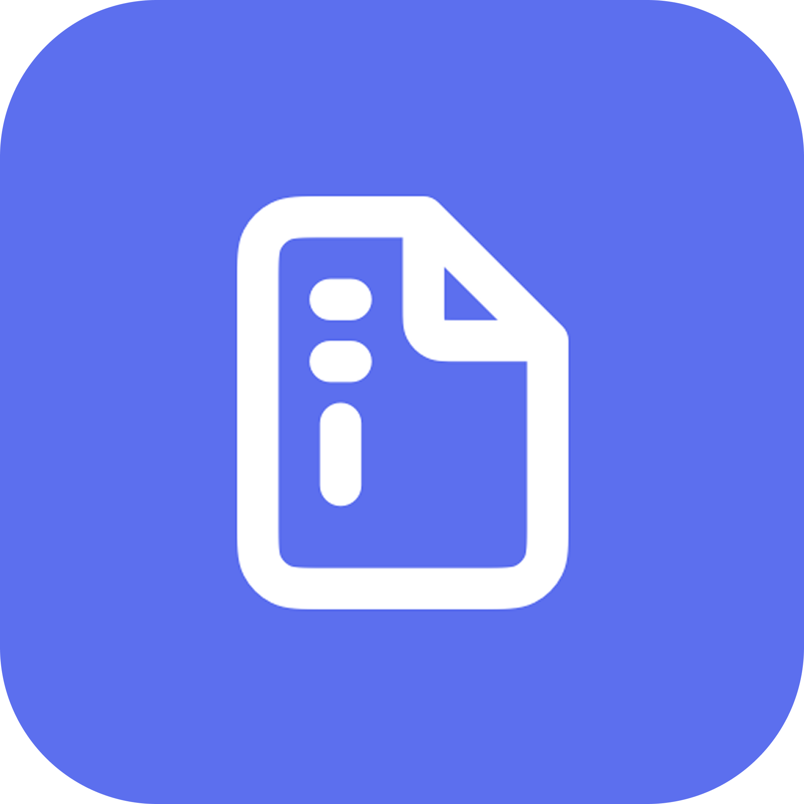
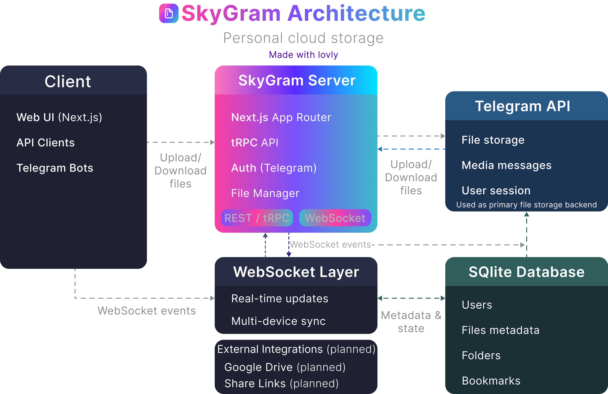

 # SkyGram - Personal Cloud Storage

SkyGram is a personal cloud storage application that uses Telegram as a drive. It allows you to upload, download, and organize your files using the Telegram API. The project is built using [Next.js](https://nextjs.org) and [Telegram Bot API](https://core.telegram.org/bots/api).

✨ The project is actively under development, expect frequent updates and new features.


Run on your local machine without any external dependencies. You just need to create a Telegram application and get the API ID and API Hash from [my.telegram.org](https://my.telegram.org).

It uses SQLite as a database to store user data and files. You can run the project using Docker or on your local machine.

## Features

- ✨ Clean UI
- 📁 Organize your content in folders
- 📤 Upload/download files
- 🔖 Bookmark files
- 🗑️ Move to trash
- 📱 Multiple accounts support
- ✅ Select multiple files at once
- 🔄 Perform batch operations (delete, move, bookmark)
- 📂 Create and manage folders
- 📄 File information display
- 🔄 Real-time updates via WebSocket
- 🌐 Multi-language support
- ⚙️ Account settings management
- 🗂️ Trash management with restore capability
- 📚 Bookmarks management
- 🎨 Dark/light theme support

## Roadmap

- [ ] Search files
- [ ] Link Google Drive
- [ ] Generate shareable link
- [ ] Custom chat for uploading files

## 🚀 Installation

Right now, you can run the project locally by following the steps below. It uses SQLite as a database.

### Docker

Use the following commands to run the project using Docker.

```bash
docker run -d -p 3000:3000 \
  -e TELEGRAM_API_ID='' \
  -e TELEGRAM_API_HASH='' \
  -e SERVER_URL='http://localhost:3000' \
  ghcr.io/mxvsh/SkyGram:latest
```

### Local Development

1. Clone the repository

```bash
git clone https://github.com/lovlygod/SkyGram.git
```

2. Install dependencies

```bash
pnpm install
```

3. Setup environment variables

```bash
cp .env.example .env
```

4. Fill in the environment variables

```env
TELEGRAM_API_ID=your_telegram_api_id
TELEGRAM_API_HASH=your_telegram_api_hash
SERVER_URL=http://localhost:3000
```

5. Run the project

```bash
pnpm dev
```

## 📋 How to use

### Adding Account

1. Click on the "Add Account" button
2. Enter your phone number
3. Verify the code sent to your Telegram
4. You're ready to use the application

### File Operations

- Upload files by clicking the upload button
- Create folders to organize your files
- Move files between folders
- Bookmark important files for quick access
- Move files to trash when no longer needed
- Rename files and folders
- Copy files
- View file information

### Multiple File Selection and Batch Operations

SawerMediaBot now supports selecting multiple files and performing batch operations:

#### Selecting Multiple Files

- **Single selection**: Click on a file to select it
- **Multiple selection**: Hold the `Ctrl` key (or `Cmd` on Mac) and click on multiple files to select them
- **Deselect**: Click on a selected file again to deselect it or use the "Cancel selection" button
- **Visual indicators**: Selected files show a checkmark in the top-right corner

#### Performing Batch Operations

Once you have selected multiple files, a toolbar will appear at the top with the following options:

- **Delete**: Move all selected files to trash
- **Move**: Move all selected files to another folder
- **Bookmark**: Add all selected files to bookmarks
- **Unbookmark**: Remove all selected files from bookmarks
- **Cancel selection**: Deselect all files

The batch operations are processed efficiently and updates are reflected in real-time in the UI.

### Real-time Updates

The application includes real-time updates via WebSocket, ensuring that any changes made from different devices or sessions are immediately reflected in the UI.

### Trash Management

Files moved to trash can be restored or permanently deleted. Access the trash through the navigation panel.

### Bookmarks

Access your bookmarked files quickly through the dedicated bookmarks section in the navigation panel.

## Technical Details

- **Frontend**: Next.js 14 with App Router
- **Backend**: Node.js with custom WebSocket implementation
- **Database**: SQLite with Drizzle ORM
- **API**: tRPC for typed API calls
- **Authentication**: Telegram API
- **UI Components**: Radix UI and custom components
- **Styling**: Tailwind CSS with animations
- **State Management**: React Context API and tRPC
- **Animations**: Framer Motion
- **File Storage**: Telegram API

## Architecture



## Environment Variables

- `TELEGRAM_API_ID`: Your Telegram API ID from my.telegram.org
- `TELEGRAM_API_HASH`: Your Telegram API hash from my.telegram.org
- `SERVER_URL`: The URL where your server is accessible
- `DATABASE_URL`: Path to your SQLite database file (defaults to local file)

## Contributing

We welcome contributions to SawerMediaBot! Feel free to fork the repository, make changes, and submit pull requests.

## License

This project is licensed under the MIT License.

## Readme in other languages

- [Русский](README_RU.md)
